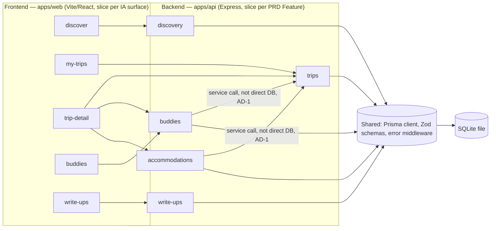
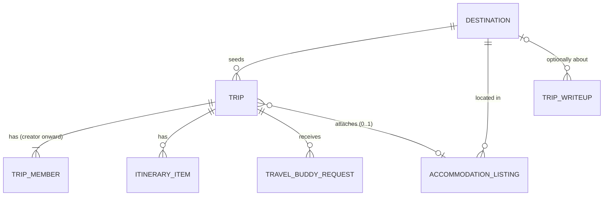

# Architecture Spine — WanderTogether

## Design Paradigm

**Vertical Slice Architecture.** Each of the PRD's five Features (§4.1–4.5) is one slice, both backend and frontend — not a horizontal layer split (controllers/services/repos as separate trees). A slice owns its routes, its service logic, and its read/write access to the entities it's responsible for; everything needed to understand one feature lives in one folder.

- **Backend slices** (`apps/api/src/features/*`): `discovery`, `trips`, `buddies`, `write-ups`, `accommodations`.
- **Frontend slices** (`apps/web/src/features/*`): one per EXPERIENCE.md IA surface — `discover`, `my-trips`, `trip-detail`, `buddies`, `write-ups` (Join a Trip is a thin entry point inside `trip-detail`, not its own slice).

Chosen over a layered/hexagonal split because the PRD's feature boundaries are already clean, stable, and unlikely to need a swappable adapter (no second database, no second UI framework) — a tutorial-scale solo build gets more from "everything about Buddies is in one place" than from port/adapter ceremony with nothing to swap in.

## Invariants & Rules



### AD-1 — Slice boundary is service-call only

- **Binds:** all 5 feature slices
- **Prevents:** the Buddies slice and the Trips slice both writing ad hoc Prisma queries to add a member to a Trip, diverging over time as one adds validation the other doesn't.
- **Rule:** a slice may read or write another slice's entities only by calling that slice's exported service function — never by importing its Prisma model or writing its own query against a table another slice owns. **Exception:** seed-only reference data (the Destination catalog, AD-12) may be read directly via Prisma by any slice — it's static and never mutated at runtime, so there's no owning slice's business logic to bypass.

### AD-2 — Trip access is link/code-based, not session-based [ADOPTED — PRD FR-6]

- **Binds:** Trip, TravelBuddyRequest, itinerary, and accommodation-attachment endpoints
- **Prevents:** one slice inventing a cookie/session check while another trusts a client-supplied flag — two incompatible access-control mechanisms in the same API.
- **Rule:** every request touching a Trip resource carries the Trip Code as a path parameter; possessing a valid code is sufficient authorization. No user/session/auth model exists anywhere in the backend.

### AD-3 — Trip Codes are random, non-sequential [ADOPTED — PRD §4.2/§9]

- **Binds:** Trip creation
- **Prevents:** a builder using auto-increment ids for Trips (guessable, defeats AD-2's access model) while other resources correctly use random ids.
- **Rule:** Trip Codes are generated with `nanoid`, minimum 10 characters, URL-safe alphabet. Never sequential/incrementing.

### AD-4 — One schema owns every entity

- **Binds:** all slices' data layer
- **Prevents:** e.g. the Buddies slice storing its own copy of "trip member," distinct from the Trips slice's member list.
- **Rule:** a single `schema.prisma` is the sole source of truth for Trip, TripMember, Destination, ItineraryItem, TravelBuddyRequest, TripWriteup, and AccommodationListing. No slice defines a competing table or duplicated shape for a concept another slice already owns.

### AD-5 — Schema is authored whole, upfront

- **Binds:** all slices' data layer (process rule for AD-4)
- **Prevents:** two builders each independently — and each "AD-4-compliantly" — inventing incompatible shapes for the same concept before a canonical schema exists (e.g. `TripWriteup` photos as a JSON array in one slice's mental model vs. a separate `Photo` table in another's).
- **Rule:** `schema.prisma` is authored complete, covering all 6 entities across all 5 features, before slice implementation begins. It is not built up piecemeal per-slice; a later field addition that touches an entity another slice consumes is a change to this one shared file, not a parallel invention.

### AD-6 — Joining a Trip always persists a TripMember

- **Binds:** trips, buddies
- **Prevents:** "any member of the target Trip" (FR-9) having no members to check against for a trip nobody joined via a buddy request — i.e., direct-link joiners silently never becoming real members.
- **Rule:** opening a Trip and submitting a Traveler Profile always creates or upserts a persisted `TripMember` row, via one shared `trips.addMember(tripCode, displayName)` function. FR-9's buddy-accept flow calls this same function. No slice may treat "member" as an ephemeral, client-only concept — PRD's "not persisted across Trips or devices" governs cross-trip identity, not within-trip membership records.

### AD-7 — Trip Code never leaks outside a code-holding context

- **Binds:** trips, buddies
- **Prevents:** the Buddies "open to buddies" browse listing leaking a Trip's own access credential, letting any visitor copy it out and self-join — silently defeating FR-8/FR-9's entire request/accept gate.
- **Rule:** any service function or endpoint returning Trip data to a discovery/browse context (reached *without* already knowing that Trip's code — e.g. the open-to-buddies listing) returns a restricted view that excludes the `code` field. Only endpoints reached via a Trip's own code in the path may include that code in their response.

### AD-8 — Itinerary mutation is last-write-wins [ADOPTED — PRD FR-5]

- **Binds:** itinerary endpoints only
- **Prevents:** one endpoint adding optimistic-lock/version checks while sibling endpoints don't, producing inconsistent conflict behavior on the same Trip. Also prevents this rule being silently extended to the whole Trip resource — a full-overwrite `PUT /trips/:code` would clobber `openToBuddies`/`attachedAccommodationId` whenever a partial update to one of those fields races with it.
- **Rule:** itinerary writes are full-resource overwrites with no version/ETag/optimistic-lock check. Every other Trip-level field (`openToBuddies`, `buddyNote`, `attachedAccommodationId`) uses PATCH-partial-merge semantics instead: only fields present in the request body change, and this is a distinct rule from itinerary's overwrite behavior, not an extension of it.

### AD-9 — One error envelope, one code vocabulary, for every endpoint

- **Binds:** all API routes
- **Prevents:** five independently-shaped error responses (one per slice) forcing the single React frontend to special-case each; also prevents upload failures (multer) surfacing as generic `INTERNAL_ERROR` while every other validation failure gets a specific code, since multer throws before Zod ever runs.
- **Rule:** every non-2xx response is `{ "error": { "code": string, "message": string } }`, produced by one shared error-handler middleware, never assembled ad hoc per route. `code` is one of a fixed vocabulary: `NOT_FOUND`, `VALIDATION_ERROR`, `CONFLICT`, `FILE_TOO_LARGE`, `INTERNAL_ERROR`. The shared middleware sits after `multer` in the chain and explicitly translates `MulterError` (e.g. its `LIMIT_FILE_SIZE` code) into this vocabulary — never left to fall through as `INTERNAL_ERROR`.

### AD-10 — Server state on the frontend goes through one data layer

- **Binds:** all 5 frontend slices
- **Prevents:** inconsistent loading/error/cache/retry behavior across surfaces — directly relevant to EXPERIENCE.md's Cold-load and Listing-failed-to-load states needing to look and behave the same everywhere.
- **Rule:** every server-data fetch/mutation goes through TanStack Query. No component uses raw `useEffect` + `fetch` + `useState` for server state.

### AD-11 — Photos are local-disk files, never DB blobs

- **Binds:** Trip Write-up photo fields
- **Prevents:** one code path storing base64 in SQLite (bloats the DB file) while another assumes a cloud URL shape; also prevents one slice modeling photos as a separate `Photo` table while another uses a flat array field for the same concept.
- **Rule:** uploaded photos are written to `apps/api/uploads/` via `multer` and referenced from `TripWriteup.photoUrls` — a JSON array of relative URL path strings, not a separate `Photo` entity. No base64-in-SQLite, no cloud object storage.

### AD-12 — Destination and Accommodation data is seed-only [ADOPTED — PRD addendum + Non-Goals]

- **Binds:** Discovery slice, Accommodations slice
- **Prevents:** an admin/create endpoint accidentally getting built for what PRD Non-Goals defines as static seed data.
- **Rule:** the Destination catalog and Accommodation dataset are populated exclusively by one Prisma seed script (`apps/api/prisma/seed.ts`), matching the addendum's JSON shape. No endpoint creates either at runtime.

### AD-13 — "My Trips" is a client-side index, not a server concept

- **Binds:** `my-trips` frontend slice, frontend `shared` layer
- **Prevents:** a builder inventing a server-side "recent trips by IP/cookie" mechanism that contradicts AD-2's stateless, code-only access model. Also prevents two flows disagreeing on what counts as "joined" — one writing an entry on every bare page view, another only on buddy-accept — leaving My Trips either polluted or missing legitimate trips depending on which flow a visitor went through first.
- **Rule:** the backend has no concept of "a user's trips." The frontend `shared` layer maintains a `localStorage` index of `{ tripCode: displayName }`, written only at two call sites: on Trip creation, and on first successful Traveler Profile submission for a code. Never on a bare `GET`/view with no profile submitted. This same index renders My Trips (by looking up each stored code via the normal per-Trip GET) and skips re-asking for a Traveler Profile on revisit.

### AD-14 — Buddy-request de-duplication is client-side, best-effort only

- **Binds:** buddies
- **Prevents:** one builder adding a Prisma `@@unique` constraint on `TravelBuddyRequest` (blocking legitimate retries, e.g. a mistyped name) while another relies on a client-side flag — the two mechanisms disagreeing and surfacing as an unexplained save failure.
- **Rule:** "one request per person per Trip" (EXPERIENCE.md) is enforced only client-side (a `localStorage` flag hiding the form on return visits from the same browser). There is no stable per-person identity to enforce this against server-side (AD-2's whole premise), so no database uniqueness constraint exists for it — this is accepted as bypassable in v1, not a gap to silently close later with a DB constraint.

## Consistency Conventions

| Concern | Convention |
| --- | --- |
| Naming (entities, files, interfaces, events) | Prisma models: PascalCase singular (`Trip`, `TripMember`). REST routes: kebab-case plural (`/trips`, `/write-ups`). JSON fields: camelCase. React components: PascalCase; slice folders: kebab-case. |
| Data & formats (ids, dates, error shapes, envelopes) | Ids: every entity id is `nanoid()` called with no arguments (its default length) — no exceptions, no "library default" ambiguity — except Trip Codes, which use AD-3's explicit 10+ character rule. Never auto-increment anywhere. Dates: ISO 8601 strings over the wire, `DateTime` in Prisma. Errors: the AD-9 envelope and code vocabulary, always. |
| State & cross-cutting (mutation, errors, logging, config, auth) | No auth (AD-2). Validation at the API boundary via Zod schemas colocated with each slice's routes. Logging: one request logger (method, path, status, duration) at the Express app level, not per-slice. Config via `.env` + a single typed config module, never `process.env` read ad hoc inside a slice. `apps/api` is ESM (`"type": "module"`) — required by `nanoid` 6's ESM-only distribution. |
| Frontend query keys (AD-10) | Every Trip read keys off `['trip', tripCode]`. A slice needing a lighter subset (e.g. My Trips' per-row summary) selects from that cached query rather than defining a parallel key — so one invalidation after any Trip mutation covers every surface, not just the slice that wrote it. |

## Stack

| Name | Version |
| --- | --- |
| Node.js | 24.x LTS ("Krypton") |
| React | 19.3 |
| Vite | 8.3.0 |
| Express | 5.2.1 |
| Prisma ORM | 7.10.0 (stable — not the 8.x release candidate line) |
| @prisma/adapter-better-sqlite3 + better-sqlite3 | latest matching Prisma 7.10.0 — Prisma 7 requires an explicit driver adapter for SQLite; the old bare `datasourceUrl` constructor option was removed in v7 |
| TanStack Query (`@tanstack/react-query`) | 5.103.2 |
| Zod | 4.6.5 |
| nanoid | 6.0.1 — pure ESM, no CJS build (see Consistency Conventions: `apps/api` is ESM) |
| multer | ^2.4.0, minimum 2.0.2 (CVE-2025-7338 DoS affects versions below 2.0.2) |

## Structural Seed



```text
wandertogether/
  apps/
    web/                      # Vite + React 19 SPA
      src/
        features/
          discover/           # Destination browse/filter, start-a-trip
          my-trips/           # Trips this session created/joined
          trip-detail/        # Itinerary, buddies panel, accommodation panel, join-a-trip
          buddies/            # Cross-trip buddy browsing
          write-ups/          # Browse + compose Trip Write-ups
        shared/                # TanStack Query client, DESIGN.md tokens as CSS vars, Row/EmptyState/Toggle components,
                                # AD-13 localStorage trip index, LiveRegion/useAnnounce utility (EXPERIENCE.md Accessibility Floor)
    api/                      # Express 5 REST API
      src/
        features/
          discovery/
          trips/
          buddies/
          write-ups/
          accommodations/
        shared/                # prisma client singleton, zod base schemas, error middleware, request logger
      prisma/
        schema.prisma          # AD-4/AD-5: sole source of truth for all entities, authored whole upfront
        seed.ts                 # AD-12: Destination + AccommodationListing seed data (PRD addendum shape)
      uploads/                 # AD-11: write-up photo files, served statically
```

## Capability → Architecture Map

| Capability / Area | Lives in | Governed by |
| --- | --- | --- |
| FR-1, FR-2 (Destination discovery, start a trip) | `discovery` slice (both apps) | AD-12 (seed-only catalog) |
| FR-3, FR-4, FR-5, FR-6 (Trip create/join/itinerary/access) | `trips` slice (both apps) | AD-2, AD-3, AD-4, AD-5, AD-6, AD-8 |
| My Trips (client-only concept, no dedicated FR) | `my-trips` frontend slice | AD-13 |
| FR-7, FR-8, FR-9 (Travel Buddies) | `buddies` slice (both apps), calling into `trips` service per AD-1 | AD-1, AD-2, AD-4, AD-6, AD-7, AD-14 |
| FR-10, FR-11 (Trip Write-ups) | `write-ups` slice (both apps) | AD-4, AD-9 (upload errors), AD-11 |
| FR-12, FR-13 (Accommodations) | `accommodations` slice (both apps), calling into `trips` service per AD-1 | AD-1, AD-4, AD-12 |

## Deferred

- **Deployment & hosting** — this spine covers local development only. SQLite-as-a-file complicates typical serverless hosts (no shared writable disk across instances); picking a host (Render/Fly.io with a persistent volume, or swapping to hosted Postgres) is deferred until the tutorial needs a live URL.
- **Real-time collaboration beyond last-write-wins (AD-8)** — PRD explicitly scoped this out for v1 (FR-5 assumption); revisit together with the ItineraryItem shape if it's ever needed.
- **Accounts / authentication** — PRD Non-Goal; AD-2's link-based model stands until that changes.
- **Rate-limiting / abuse prevention** on public write endpoints (buddy requests, write-ups) — PRD Open Question; no account system exists yet to throttle or ban against.
- **Real payment / booking-provider integration** — PRD Non-Goal; AD-12's seed-only Accommodation dataset stands until that changes.
- **Itinerary structure beyond a flat list** (e.g. grouping by day) — carried open from the PRD; not this spine's call to make.
- **Trip retention/expiry** — Trips are retained indefinitely with no cleanup/TTL job in v1. This is a deliberate decision, not a silent gap: it closes the question of what a stale `localStorage` entry in My Trips (AD-13) should do when its code no longer resolves — there is no such case in v1, since nothing ever deletes a Trip.
- **Prisma 8** reaches general availability around October 2026, within roughly a month of this spine. Prisma 7 (this spine's pin) gets 18 months of support past that GA — revisit deliberately if the project outlives that window; don't casually `npm update` across a major.
