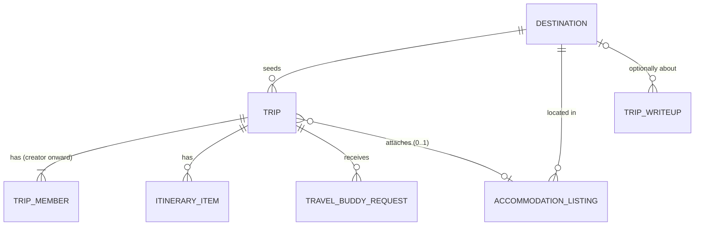

# Solution Design — WanderTogether

This document explains the *why* behind [`ARCHITECTURE-SPINE.md`](./ARCHITECTURE-SPINE.md) in prose — the trade-offs weighed, the alternatives rejected, and the reasoning a terse `AD` block deliberately leaves out. **The spine is the build contract; if anything here ever seems to disagree with it, the spine wins.** This doc is for understanding, not implementation.

## What WanderTogether is

A portfolio project built to practice the BMAD planning-to-build method: a React web app where a group of friends plans a trip together — discovering destinations, building a shared itinerary, optionally inviting a travel buddy, reading other travelers' write-ups, and picking a place to stay — in one product instead of five. Full product framing lives in the [Product Brief](../../briefs/brief-WanderTogether-2026-09-27/brief.md) and [PRD](../../prds/prd-WanderTogether-2026-09-27/prd.md); this document picks up from "what to build" and covers "how it's structured."

## The central constraint: no accounts, but real shared data

Almost every architectural choice below traces back to one PRD decision: **there is no login.** A Trip is reached by a shareable code or link, and anyone holding that code can view and edit it. That sounds like it simplifies things — no auth system to build — but it actually creates the most interesting problems in this spine:

- If there's no session, how does the frontend know which Trips *this browser* has created or joined, in order to show a "My Trips" list? (→ AD-13)
- If a code is the only credential, what happens the moment that code appears somewhere it shouldn't — like a public "browse trips" listing? (→ AD-7, the most serious issue this spine's review caught)
- If nobody has an account, how do you stop the same person submitting five buddy requests to the same trip? (Short answer: you mostly don't, on purpose — AD-14)

Keep this constraint in mind while reading the rest — it's the thread connecting several otherwise-unrelated-looking decisions.

## Architecture style: Vertical Slice, not Layered

**The choice:** each of the PRD's five features — Discovery, Group Trip Planning, Travel Buddies, Trip Write-ups, Accommodations — is a *slice*: one folder containing everything about that feature, front and back. Not a traditional layered split (all controllers in one tree, all services in another, all repositories in a third).

**The alternative considered:** a classic layered or hexagonal/ports-and-adapters architecture, which is the more common answer for "how should a backend be organized."

**Why vertical slices won here:** hexagonal architecture earns its complexity when you might swap an adapter — a different database, a different UI, a plugin system. Nothing about this project has a second implementation waiting in the wings: one database (SQLite via Prisma), one frontend (this React app), no plugin surface. What this project *does* have is five cleanly bounded features that a solo builder (or a tutor reviewing the code) benefits from being able to open one folder and see everything about "Buddies" in one place, rather than hunting across three parallel trees. For a tutorial-scale build, that legibility matters more than an abstraction with no second implementation to justify it.

**The one wrinkle:** slices aren't fully independent. Accepting a buddy request needs to add a Trip member — logic that the Trips slice, not Buddies, owns. AD-1 resolves this with a simple rule: cross-slice access always goes through the owning slice's exported function, never a direct database query. Two slices are still allowed to talk to each other; they're just not allowed to *quietly duplicate each other's logic*.

## The two fixes that mattered most

Every architecture review turns up nitpicks. Two findings from this one were substantive enough to walk through directly, because they're the kind of thing that's obvious once pointed out and easy to miss otherwise.

### 1. The Trip Code almost leaked through its own "browse" feature

Travel Buddies (FR-8) works by letting a stranger browse Trips that are open to new members and request to join one. The natural way to build that listing is: fetch the matching Trip rows, return them. But a Trip row includes its own `code` — and the code *is* the entire access-control mechanism (AD-2). Return the code in a browse listing, and anyone looking at the Buddies tab can copy it straight out and self-join, skipping the request-and-accept step FR-8/FR-9 exist to enforce. Nothing about the original spine forbade this — AD-2 says "possessing a code is sufficient," but never said anything about *who gets handed a code and how*. AD-7 closes this: any Trip data returned to a context that didn't already have the code (a browse/discovery listing) comes back in a restricted shape with the code stripped out. Only an endpoint reached *via* a code gets to return that code.

This is the kind of bug that's invisible in a demo where you, the builder, are the only person clicking through — and completely obvious the first time someone else tries to abuse it. Catching it at the architecture stage, before any code exists, is the whole point of doing this review now.

### 2. "Joining a Trip" needed to mean one specific thing

The PRD says a Traveler Profile (your display name) is "not persisted across Trips or devices" — reasonable, since there's no account to persist it *to*. But that phrase is ambiguous about something more basic: when you open a Trip and type in a name, does that create a real, queryable record of you as a member of *that* Trip? It has to — FR-9's accept flow only makes sense if "any member of the target Trip can accept or decline" refers to real rows in a real table. AD-6 pins this down: opening a Trip and setting a name always creates (or reuses) a persisted `TripMember` row, through one shared function that both the everyday "click the link and join" path and the buddy-accept path call. Without that AD, it's easy to imagine a Trips-slice builder treating membership as ephemeral (nothing to persist, no account after all) while a Buddies-slice builder assumes it's real — and the accept button quietly does nothing.

## Tech stack, and why each piece

| Choice | Why this one |
| --- | --- |
| **React 19.3 + Vite 8.3.0** | The brief already commits to "React-based web app" — a plain SPA, not a full-stack meta-framework. Vite is the standard, current pairing: fast dev server, minimal config, no framework opinions to fight. |
| **Node.js 24 LTS + Express 5.2.1** | Express 5 has been the recommended default over Express 4 since early 2025; a separate REST API (rather than folding backend logic into a framework like Next.js) keeps the "plain React SPA" framing honest and keeps the backend simple enough to reason about on its own. |
| **Prisma ORM 7.10.0 + SQLite** | No accounts and no real integrations means no need for a hosted database — SQLite is a single file, zero setup, and completely adequate for a portfolio project's real (if modest) load. Prisma gives type-safe queries without hand-writing SQL. One catch worth knowing if you build this literally as written: Prisma 7 dropped its old built-in SQLite path — you need `@prisma/adapter-better-sqlite3` explicitly, not just `prisma` + `sqlite` in the datasource block. |
| **TanStack Query 5.103.2** | Six different screens all fetch and cache server data (destinations, a trip, buddy requests, write-ups, accommodations). Without one shared library handling loading/error/cache/retry, five slices built somewhat independently will each roll their own version of "is this loading, did this fail" — and they *will* look and behave differently. This was worth an AD (AD-10) specifically because EXPERIENCE.md requires those states to look identical everywhere. |
| **nanoid 6.0.1** | Trip Codes need to be unguessable (they're the access control), so random generation, not auto-incrementing ids, is non-negotiable (AD-3). One catch: nanoid 6 dropped CommonJS support entirely — it's ESM-only. That's why the spine commits the whole API to ESM (`"type": "module"`) rather than the more old-fashioned CommonJS Express setup you might reach for by habit. |
| **Zod 4.6.5** | Request validation at the API boundary. Chosen because it's the de facto standard for TypeScript validation and pairs naturally with Prisma's generated types. |
| **multer** (pinned ≥2.0.2) | The standard Express file-upload middleware, for Trip Write-up photos. Pinned to a minimum version deliberately — an older 1.x/early-2.x release has a couple of known denial-of-service issues in its multipart parser. |

## Data model, in plain language

- **Destination** is static, seeded content (Lisbon, Bali, Reykjavík, …) — nobody creates one at runtime. It's the anchor everything else hangs off: a Trip picks one, an Accommodation belongs to one, a Write-up optionally mentions one.
- **Trip** is the center of the product. It's created once, then edited by anyone holding its code — that's the whole "no accounts" model in one sentence.
- **TripMember** exists because of the fix described above — every person who's opened a Trip and named themselves has a row here, whether they arrived by direct link or by an accepted buddy request.
- **ItineraryItem**, **TravelBuddyRequest**, and the optional link to **AccommodationListing** are the three concrete things a Trip actually *has* once it exists — the plan, the open invitation (if any), and the place to stay (if picked).
- **TripWriteup** deliberately does *not* belong to a Trip. The PRD frames write-ups as independent trip reports anyone can publish — they optionally reference a Destination for browsing, but they're not tied to any specific Trip record.

## How a request actually flows (the parts that aren't obvious from the spine's terse rules)

**Creating and sharing a Trip:** someone picks a destination, fills in dates, and gets back a code/link immediately — no signup step interrupts that. The frontend also drops that code into its local `My Trips` index right away (AD-13), so the creator sees it in their own list without needing to "join" anything.

**A friend opening that link:** they hit the API with the code in the URL, get prompted for a display name, and that submission is the moment a real `TripMember` row gets created (AD-6) *and* the moment their browser's local index picks up the trip too (AD-13). Notably: just *viewing* a trip via a link — without ever submitting a name — deliberately does **not** add it to My Trips or create a member row. Only a name submission counts as "joining."

**Editing the itinerary vs. toggling "open to buddies":** these look like similar "edit a trip" actions but follow different mutation rules on purpose. Itinerary edits are full overwrites with no conflict detection (AD-8) — simple, and fine for a small friend group where a genuine simultaneous edit is rare. But the same overwrite behavior applied to the whole Trip record would be dangerous: toggling "open to buddies" and editing the itinerary from two different tabs at the same moment could silently erase each other's work if both use full-overwrite `PUT`. So non-itinerary fields (the toggle, the attached accommodation) use partial-update semantics instead — only the fields actually sent in a request change.

**A stranger requesting to join:** they see a restricted view of the trip (no code, per AD-7) with just its note and open-slot info, submit a request, and a member of the trip accepts or declines it from the Trip page. Accepting calls the exact same "add a member" function a direct-link join uses (AD-6) — there's deliberately only one path into membership, not two.

## What this spine chose not to decide (and why that's fine for now)

A spine's job is to fix only what would let two independently-built pieces genuinely diverge — everything else is either obvious from the code once it exists, or genuinely doesn't matter yet. A few things worth calling out explicitly:

- **No rate-limiting on public write endpoints** (buddy requests, write-ups). With no accounts, there's no user to throttle against yet — this is an accepted gap for a tutorial project, not an oversight.
- **No expiry on Trips.** They live forever. This sounds like it should be a problem, but it isn't one *yet* — deciding otherwise would mean designing what happens to a stale entry in someone's My Trips list, which is real design work this project doesn't need to do for a portfolio build.
- **"One buddy request per person per Trip"** is enforced client-side only, on the honor system. There's no stable identity to enforce it against server-side without accounts, so a determined person could submit twice. That's accepted, not solved — and explicitly *not* patched over with a database constraint that would just create a different, more confusing bug (a client that thinks it's allowed to submit, rejected by a database rule it doesn't know about).
- **Deployment.** This spine covers running the app locally. SQLite-as-a-single-file makes the usual "just deploy to a serverless host" answer more complicated than it is for a hosted database — that's a real decision, deliberately deferred until there's an actual need for a live URL.

## Where to go from here

This spine and this document together are the input to the next BMad step, breaking the PRD and this architecture into epics and stories (`bmad-create-epics-and-stories`). Every `AD` in the spine carries a stable id — FR-9's story, for instance, should cite AD-6 and AD-7 directly rather than re-deriving "how does accept work" from scratch.
